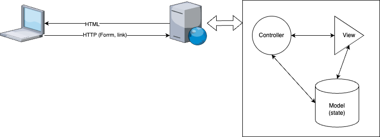
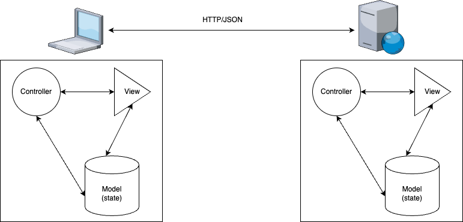
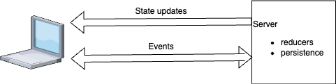

# Beyond Request/Response
### Why and how we should change the way we build web applications
Chris Nelson
@superchris
chris@launchscout.com


---

<!-- footer:  -->
# Who am I?
- 25+ year Web App Developer
- Co-Founder of Launch Scout
- Creator of LiveState

---

# We need to change the way we build web applications
### This is a big claim, right?

---

# Where are we?
- Is your experience of web app development better than it was 5 years ago?
  - Is it easier for people to get started?
  - Are you building better apps faster?
- Why is there a new JS framework every week?
  - Would this happen if we had something that most people were happy with?

---

# Here's what I want to prove:
- It doesn't have to be this way
- We can have (and deserve!) a simpler, more productive experience
- Everything we need is already out there
- Most of it is based on web standards rather than framework du jour

---

# First let's talk about how we got here

---

# In the beginning there was CGI
- Scripts that printed out HTML
- Perl, VB, PL/SQL, you name it!
- This was ok for little tiny things
- For large applications, not so much

---

# Reasons
- HTTP is stateless, but applications are not
- Code organization was pretty random :(
- Perl is a write only language ;)
- DB stored procs that generated HTML
  - Need I say more?

---

# On the second day there was MVC
- Finally we could organize our code
- A place for everything
- Java, .NET

---

# Server side MVC



---

# On the third day DHH created Rails
- Convention over configuration
- Really productive language
- State lives in the DB
- We could build apps really fast

---

# And it was good..
## We were pretty productive at building web apps

---

# And then AJAX happened
- The user experience got a lot better
- The developer experiences, not so much..
- Previous server side MVC was no longer viable

---

# Two approaches

---

# Client side MVC
1. Let's apply same good ideas that worked server side in JS!
2. Let's build a JS MVC framwork!
3. Ugghh this one got big and complicated...
4. Go to 1.

---

# I know, we'll just use one language!
- Rails RJS (remote javascript)
- Server side JS framworks
- Compile *insert language here* into JS

---

# How'd that turn out?
- Mostly, not that great :(
- Turns multiple languages isn't the most important problem
- Client MVC and server MVC means 2 applications to keep in sync

---

# All the MVCs



---

# What makes things so complicated?
- HTTP is stateless, our applications have state
- With server-side MVC we had a place for our state
- Now it lives in (at least) two places..
  - And it's our job to keep it in sync(ish)

---

# Congratulations! We are building distributed systems
## And building distributed systems is hard...
- Shared mutable state is hard
- Across the network boundary it is almost impossible
- For emphasis, see CORBA

---

# And all that client side code...
- Client side build tools
- Dependency management
- Compilation and transpilation

---

# This is where we've been for about 10 years
### *Le sigh*

---

## Oof, that was depressing...
# Let's talk about some good ideas!

---

# Let's talk about managing state...

---

## We see the same Design Pattern again and again
- Redux
- Elm
- GenServers
- LiveView
- It keeps emerging..

---

# The core idea
## A functional design pattern for managing state
- Reducer functions which take
  - Event (w/payload)
  - Current state
- And return:
  - A new state

---

# Todo list reducer
* Add item event
  ```js
  todoReducer({name: "Add item", item: "Get Milk"}, [])
  ```
* Returns new state: ```["Get Milk"]```
* Add a second item
  ```js
  todoReducer({name: "Add item", item: "Speak at Momentum"}, ["Get Milk"])
  ```
* Returns new state: ```["Get Milk", "Speak at Momentum"]```
---

# Things we like
- Easy to understand
- State is immutable
- Well suited to functional languages

---

# It needs a name!
- Functional Reactive Programming?
- Maybe, but kinda not

---

# My proposal: Event State Reducers
## Spread the word!

---

# Another good idea: "dumb" clients
- React
- EmberJS (actions up, data down)
- LiveView functional components

---

# Keeping client code simple
- render data
  - often passed in as props
- dispatch events
- Step 3: Profit!

---

# Let's make a comment section

---

## `<comments-section>` element
```ts
@customElement('comments-section')
export class CommentsSectionElement extends LitElement {

  @state()
  comments: string[] = [];

  render() {
    return html`
      <ul>
        ${this.comments.map((comment) => html`<li>${comment}`)}
      </ul>
      <form @submit=${this.addComment}>
        <div>
          <label>Comment</label>
          <input name="comment" />
        </div>
        <button>Add comment</button>
      </form>
    `;
  }

  addComment(e: SubmitEvent) {
    e.preventDefault();
    this.dispatchEvent(new CustomEvent('add-comment', {detail: {comment: this.commentInput.value}}));
    this.commentInput!.value = '';
  }
}
```
---

# But how do we actually add comments?
- We could make an API
  - REST
  - GraphQL
- Is there a simpler way?

---

# What if we put these ideas together?
## On the client:
- render state
- dispatch events
- subcribe to changes from server
## On the server:
- receive events
- reducer functions compute new state
- push state changes to clients

---

# Diagram


---

# LiveState
- An implementation of this pattern
- Not the first, not the only
- Client code javascript npm
- Server side Elixir library

---

# Finishing our Comment Section
```ts
@customElement('comments-section')
@liveState({
  topic: 'comments:all',
  url: 'ws://localhost:4000/live_state',
  events: {send: ['add-comment']}
})
export class CommentsSectionElement extends LitElement {

  @state()
  @liveStateProperty()
  comments: string[] = [];
...
```
---
# Server side reducer
```elixir
defmodule SimpifiedCommentsWeb.CommentsChannel do
  @moduledoc false

  use LiveState.Channel, web_module: SimpifiedCommentsWeb

  @impl true
  def init(_channel, _params, _socket) do
    {:ok, %{comments: []}}
  end

  @impl true
  def handle_event("add-comment", %{"comment" => comment}, %{comments: comments} = state) do
    {:noreply, Map.put(state, :comments, [comment | comments])}
  end

end
```
---

# Putting it all [together](wobsite.html)
```html
<html>
  <head>
    <script type="module" src="http://localhost:4000/assets/app.js"></script>
  </head>
  <body>
    <h1>Pretend website</h1>

    Comments below...
    
    <comments-section></comments-section>
  </body>
</html>
```
---

# How does this even work?
- `<comments-section>` makes WebSocket bidirectional connection during `connectCallback`
- `add-comment` event listeners are added to push events over the WS connection
- state updates arrive over WS connection
- listeners for state change events update the `comments` property in `<comments-section>`
- `Lit` re-renders on prop changes

---

# Why Elixir?
- Erlang/OTP: 25 years of distributed computing learning baked in
- Extremely light-weight processes to manage state
  - Each connection has their own process and state
- High availabity, concurrent
- Phoenix Channels
  - An thin abstraction over WebSockets

---

# Things we like
- Bi-directional
- Serve HTML from anywhere (include file://)
- State lives on the server
  - Not shared
  - Immutable

---

# Other things we like
- No longer request/response
  - Event oriented
  - PubSub
- Real time is essentially free!
  - Events can come from other sources
  - Computing state and notifying clients is the same

---

# Real-time comments!

---
## Just sprinkle in some [PubSub...](wobsite.html)
```elixir
defmodule SimpifiedCommentsWeb.CommentsChannel do
  @moduledoc false

  use LiveState.Channel, web_module: SimpifiedCommentsWeb
  alias Phoenix.PubSub

  @impl true
  def init(_channel, _params, _socket) do
    PubSub.subscribe(SimpifiedComments.PubSub, "comments")
    {:ok, %{comments: []}}
  end

  @impl true
  def handle_event("add-comment", %{"comment" => comment}, state) do
    PubSub.broadcast(SimpifiedComments.PubSub, "comments", {:add_comment, comment})
    {:noreply, state}
  end

  @impl true
  def handle_message({:add_comment, comment}, %{comments: comments} = state) do
    {:noreply, Map.put(state, :comments, [comment | comments])}
  end

end

```
---

# So that's cool but I want more control!
- I want to control the HTML that renders my comments
- What if I could creat the template to render the comments? 
- What if I didn't have to make a custom element to do it?

---

# What do we need?
- We've had the `template` element
- We haven't had a way to add dynamic bits
- W3C specs that aim to solve this
  - Template instantiation
  - DOM Parts

---

# No the specs are not final but...
- Multiple polyfill implementations exist
- They are largely interoperable

---

# Introducing `<live-template>`
- Connects a template to a Livestate
- Renders state
- Dispatches events
- Repeat...

---

# An interesting aside..
- We don't need a build tool
- import maps are :fire:
- let your browser resolve and fetch dependencies
- jspm makes it ridonkulously easy

---

# Let's write some code

---

# Other implementations of some of these ideas
- Phoenix LiveView
 - the original
 - Elixir on client and server
 - Lots of JS to make it work, but you (usually) don't have to touch it :)

---
# LiveView client
```html
<dl>
  <%= for comment <- @comments do %>
    <dt><%= comment["author"] %></dt>
    <dd><%= comment["text"] %></dd>
  <% end %>
</dl>
<form phx-submit="add_comment">
  <div>
    <label>Author</label>
    <input name="author" />
  </div>
  <div>
    <label>Comment</label>
    <input name="text" />
  </div>
  <button>Add comment</button>
</form>
```
---

# LiveView server
```elixir
defmodule SimpifiedCommentsWeb.CommentsLive do
  use SimpifiedCommentsWeb, :live_view

  def mount(_parms, _session, socket) do
    {:ok, socket |> assign(:comments, [])}
  end

  def handle_event("add_comment", comment, %{assigns: %{comments: comments}} = socket) do
    {:noreply, socket |> assign(:comments, [comment | comments])}
  end
end
```

---

# Other other implementations
- LiveViewJS
- Hotwire (kinda?)
- use-live-state React hook

---

# But is this actually viable?
- Heck yes
- We've been building LiveView apps for a couple years
- LiveState is newer but starting to catch on
- Our dev experience is radically improved
- We're hitting estimates at a rate we haven't since Rails

---

# Production examples
- [Launch Elements](https://launch-cart-dev.fly.dev/)
  - [Demo](tiny-store.html)
- [LiveRoom.app](https://liveroom.app)
- [Cars.com](https://cars.com)

---

# Bonus round!:
- WebAssembly!
- Until fairly recently, not super practical
  - Calling WebAssembly modules with anything other than numbers was a nightmare
- Things like Extism and WebAssembly Components eliminate this hurdle
- Writing event handlers in the language of your choice is now possible!

---

## Livestate [todo list](http://localhost:4004) reducer in Javascript (compiled to wasm)
```js
import { wrap } from "./wrap";

export const init = wrap(function() {
  return { todos: ["Hello", "WASM"]};
});

export const addTodo = wrap(function({ todo }, { todos }) {
  return { todos: [`${todo} from WASM!`, ...todos]};
});

```
---

# In conclusion
- We can make web development simpler
- We can leverage web standards to help
- Our libraries should be small and getting smaller
- New web standards may not get the PR of giant frameworks but they are worth paying attention to!

---

# Thanks!

---